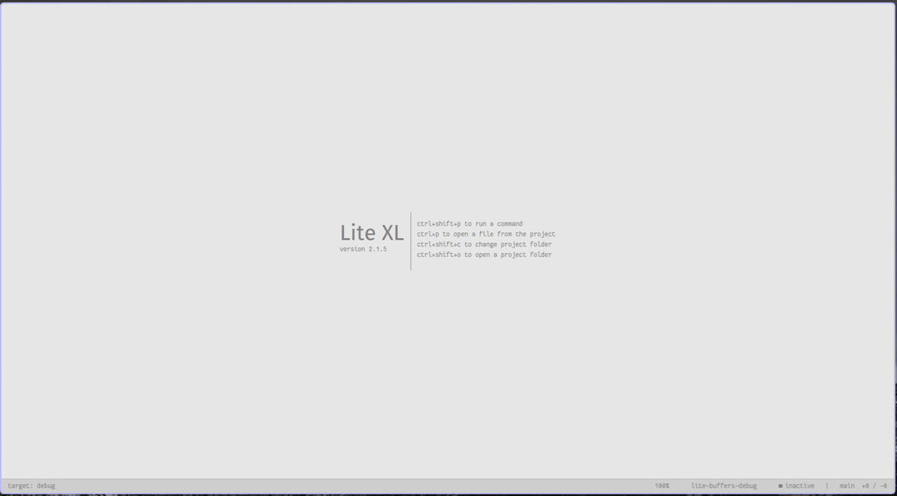

# Lite XL Previewer

Preview files and buffers before opening



## Configuration

| Field                                  | Default | Comment                                                   |
|:---------------------------------------|:-------:|:----------------------------------------------------------| 
|`config.plugins.previewer.max_size`     | 1000000 | maximum size in bytes of file to preview                  |
|`config.plugins.previewer.only_opened`  | `false` | preview only document that are already opened             |
|`config.plugins.previewer.simplified`   | `true`  | preview file without syntax highlighting                  |
|`config.plugins.previewer.ignore_ext`   | `{...}` | list of file extension to ignore in the preview           |
|`config.plugins.previewer.ignore_bin`   | `{...}` | map of binary sequence to ignore (e.g. `ELF`)             | 


## Interface

When calling `CommandView:enter_with_preview(label, ...)` it is possible to pass
a custom function to extract document from the suggestion element, to do so:

```lua
CommandView:enter_with_preview("LABEL", {
  suggest=..., -- as usual
  submit = ..., -- as usual
  cancel= ..., -- as usual (optional)
  validate = ..., -- as usual (optional)
  preview = function (item) return item.doc end -- function to extract document from currently selected item
                                                -- if return nil no preview will be shown
                                                -- it must return a `Doc` object or `nil`
})
```
If no `preview` function is passed, it expects to have a field `doc` in the suggestion items.
Please look at the plugin [buffers](https://codeberg.org/Mandarancio/lite-buffers) to see a use case.

Additionally the following helper functions are exposed:

 - `Previewer.close_preview` to close the preview
 - `Previewer.file_previewer` that is used to get a document from a file path (respecting the plugin configuration).

This last function is the one 

## Commands

The default commands `core:find-file` and `core:open-file` are overwritten to use
the `enter_with_preview` command instead of the base `enter` to enable the previews.
